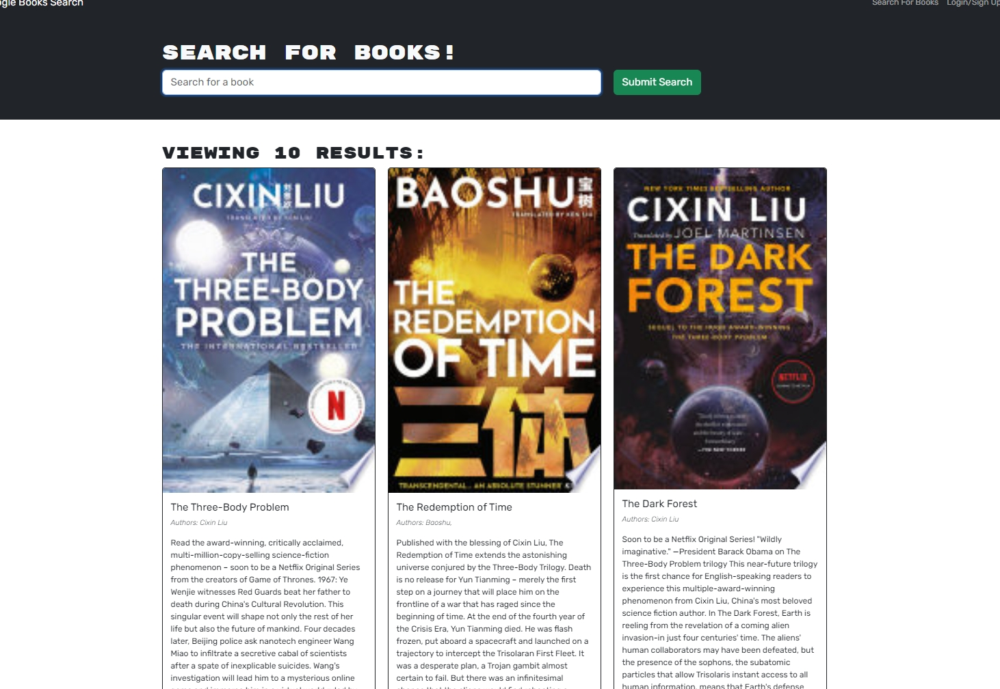
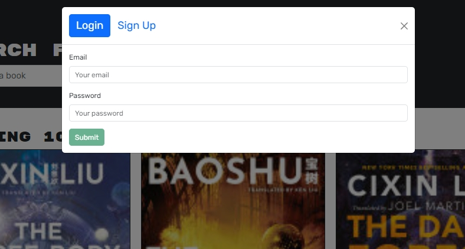
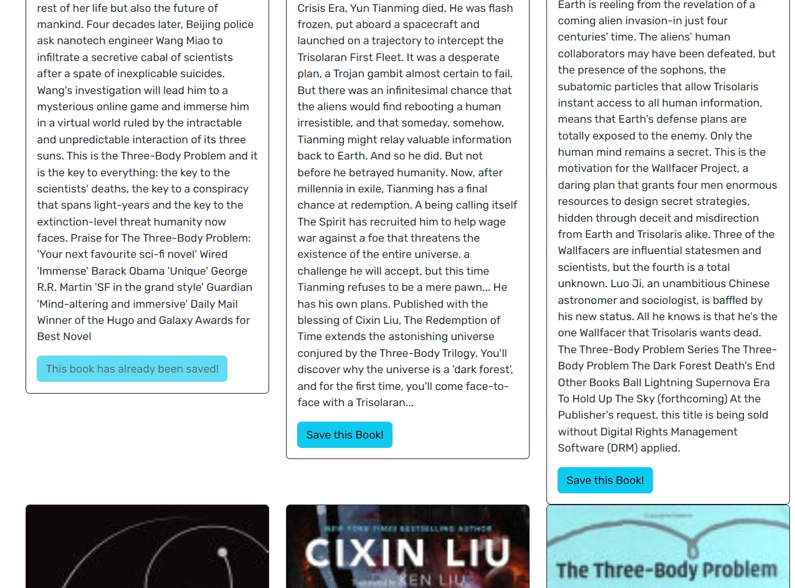
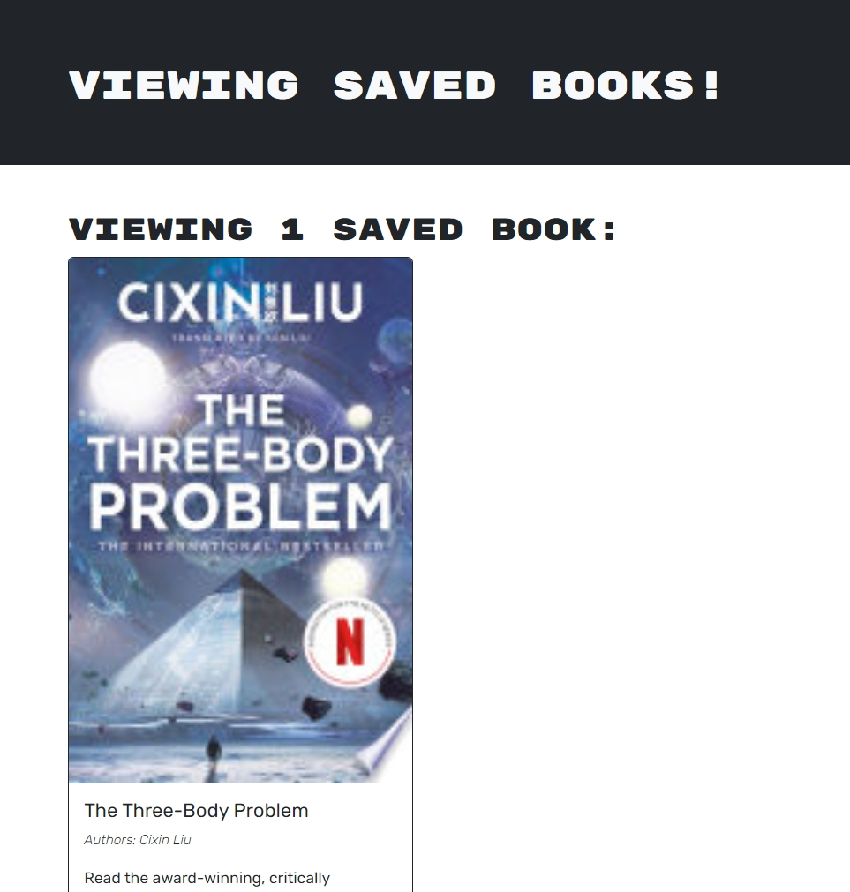

# bookSearchEngine

## Description

a MERN challenge to change a RESTful API style app to MERN Stack. This app achieves using data from google to search books and have a simple login function for users to store their books.

## Table of Contents

- [Installation](#installation)
- [Usage](#usage)
- [License](#license)
- [Contribution](#contribution)
- [Test](#test)
- [Further Questions](#furtherquestions)

## Installation

for local installtion:

Open the directory from VS Code.

1. run `$npm install` to install packages.

2. run `$npm run develop` to start the app

3. the app should pop from the default browser automatically, otherwise use [localhost:](http://localhost:3000) to start

for online user:
1. simply open this link to use:
https://pwa-text-editor-jvnq.onrender.com

## Usage

1. open the link to see a page that you can search for books

  

2. you can login to save books and display your saved books on your personal page

  
  

3. you have a personal page, you can delete the books you saved

  
  

## License

N/A

## Contribution
You can contribute to this application by revising the codes here:  
https://github.com/mkdkck/bookSearchEngine

## Test
N/A

## FurtherQuestions

please review the codes here：  
https://github.com/mkdkck/bookSearchEngine

or contact the owner via: colin173@gmail.com

## Badges

